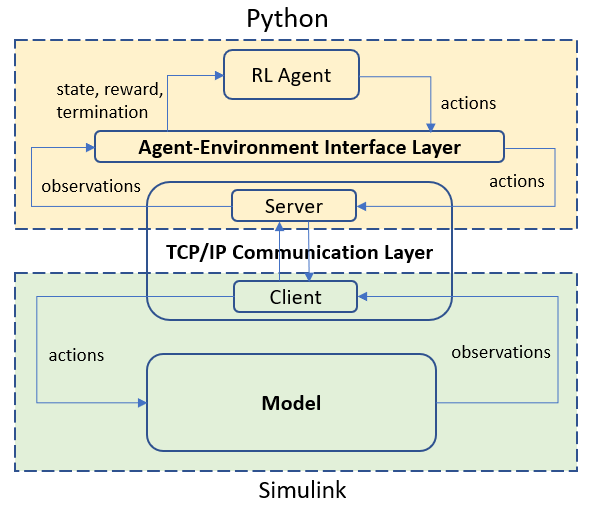
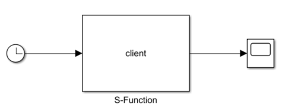

# simupy

This repository demonstrates the method I used in my work to build a TCP/IP communication channel between a Simulink model and Python. UDP will be similar. 

## Motivation

Training in reinforcement learning requires running thousands of simulations, requiring as fast speeds as possible. TCP/IP is an efficient and reliable way to establish communication between Simulink and Python. 

The Simulink model is compiled into a standalone executable, although this is not a necessary step if speed is not a concern. The communication layer is a TCP/IP interface containing the Simulink client and the Python server. This channel uses socket communication to handle low-level data transfer between the two processes and uses file I/O to pass parameters into the model. If communication accuracy is not critical, then UDP will work as well. 

## Description

This example uses a very simple setup of a Python server that echos a clock input from a Simulink client. We use an [S-Function](https://www.mathworks.com/help/simulink/sfg/what-is-an-s-function.html) that calls C code to perform the data transfer. A more detailed step-by-step guide is [here](simupy/tutorial.md).

This repository includes:
1. `simulink.slx` is a bare-bones Simulink model that calls `client.mexw64`.
2. `client.c` is compiled into `client.mexw64` and acts as the client. 
3. `server.py` acts as the server. 
4. `port.txt` contains the port number to demonstrate passing parameters into Simulink using file I/O.

## Instructions

1. Install python3 and MATLAB/Simulink. The Python standard library is sufficient. 
2. If required, compile `simulink.slx` into a standalone executable using i.e. Simulink Coder. 
3. First run the server side (`server.py`). 
4. Then, run the client side (`simulink.slx` or its executable). 

You should see the clock output being printed. 